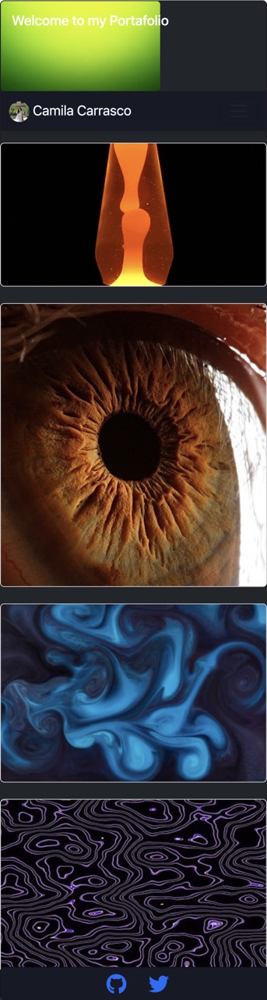

# Portfolio

This portfolio showcases a collection of projects and collaborations developed . It serves as a platform to display my coding skills and experiences as a web developer.

## Deployment

This portfolio is deployed on Netlify and can be accessed [here](https://659ce73649992a00080d14f8--serene-truffle-18b72a.netlify.app/).

## Description

This portfolio aims to presents my skills in creating interactive and responsive web applications using React.

- React
- HTML
- CSS (Bootstrap framework)
- JavaScript

## Features

- Mobile-first design approach for responsiveness
- Navigation to various sections of the portfolio
- Showcase of multiple projects with project details

## Future Improvements

- Integration of backend functionalities
- Additional projects and their details
- Contact form 
- Proper display of images
- Enhancements in design and user experience

